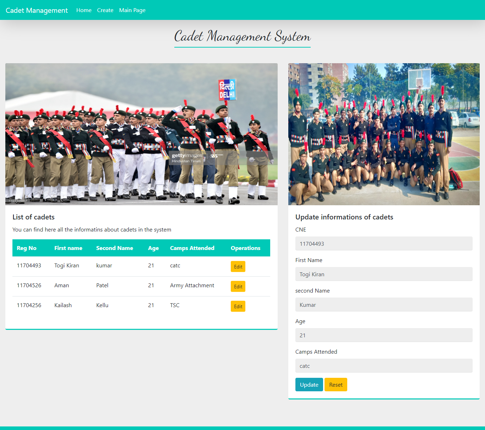

# Cadet-Management-System-Laravel
Simple project to manage the cadet information such as camps attended and personal details
Technologies used: Laravel,MySql,bootstarp,html5

# Landing Page
User can see the list of cadets

# Create Page
To add infomation of new cadet

# Update page
Used to update the information of cadet

# Database
table view of database/cadet information

# LPU-NCC Main Page

